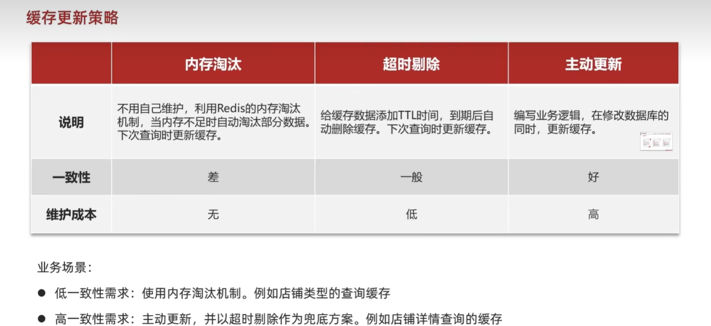
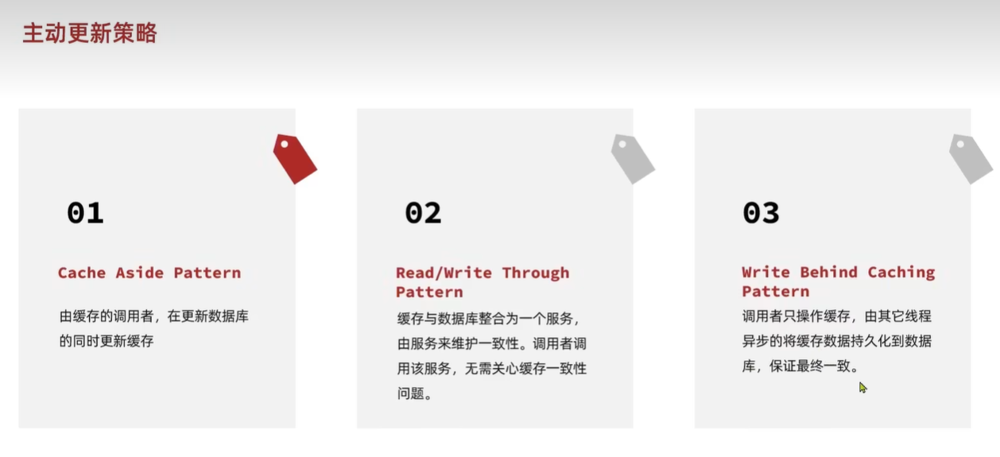
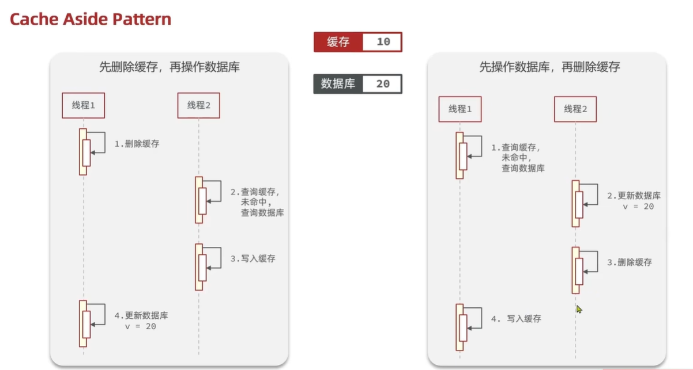
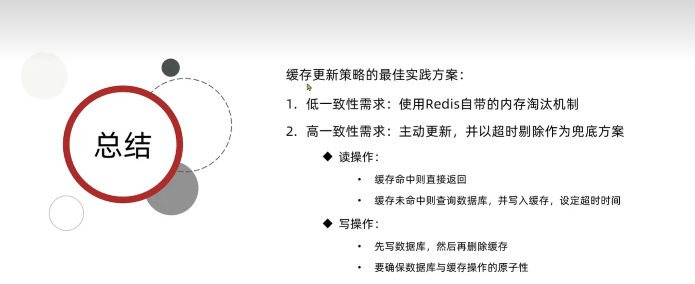
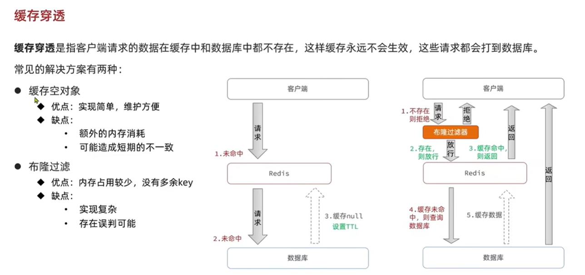

# Redis 緩存

---

## Redis 緩存策略

### 操作緩存和資料庫時有三個問題需要考慮:
- 1.刪除緩存還是更新緩存?  
  **更新緩存**: 每次更新資料庫都更新緩存，無效寫操作比較多(不適用)  
  **刪除緩存**: 更新資料庫時讓緩存失效，查詢時在更新緩存
- 2.如何保證緩存與資料庫的操作同時成功或失敗?  
  **單體系統**: 將緩存與資料庫操作放在一個事務  
  **分布式系統**: 利用TTC等分布式事務方案
- 3.先操作資料庫還是先操作緩存?  
  先刪除緩存，在操作資料庫(多執行緒併行，容易發生緩存資料庫不一致性。不適用)  
  先操作資料庫，在刪除緩存(多執行緒併行，發生緩存資料庫不一致性機率比較小)

--- 

## Redis 緩存穿透
