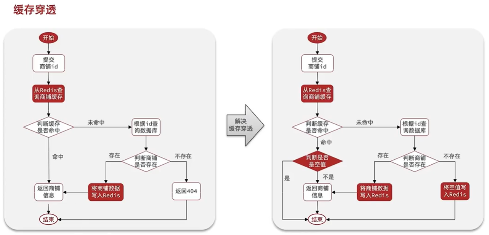

# Redis 緩存

---

## Redis 緩存策略


### 操作緩存和資料庫時有三個問題需要考慮:
- 1.刪除緩存還是更新緩存?  
  **更新緩存**: 每次更新資料庫都更新緩存，無效寫操作比較多(不適用)  
  **刪除緩存**: 更新資料庫時讓緩存失效，查詢時在更新緩存
- 2.如何保證緩存與資料庫的操作同時成功或失敗?  
  **單體系統**: 將緩存與資料庫操作放在一個事務  
  **分布式系統**: 利用TTC等分布式事務方案
- 3.先操作資料庫還是先操作緩存?  
  先刪除緩存，在操作資料庫(多執行緒併行，容易發生緩存資料庫不一致性。不適用)  
  先操作資料庫，在刪除緩存(多執行緒併行，發生緩存資料庫不一致性機率比較小)
## [示範如何使用  緩存穿透/緩存擊穿](../../../hm-dianping/src/main/java/com/hmdp/service/impl/ShopServiceImpl.java)


--- 

## Redis 緩存穿透



---

## Redis 緩存雪崩


---

## Redis 緩存擊穿


## Redis 緩存穿透/緩存擊穿 工具封裝
```java
@Slf4j
@Component
public class CacheClient {

  private StringRedisTemplate stringRedisTemplate;
  private static final ExecutorService CACHE_REBUILD_EXECUTOR = Executors.newFixedThreadPool(10);

  public CacheClient(StringRedisTemplate stringRedisTemplate) {
    this.stringRedisTemplate = stringRedisTemplate;
  }

  /**
   * 寫入 Redis(Redis設置過期時間，時間到會自動刪除)
   *
   * @param key
   * @param value
   * @param time
   * @param unit
   */
  public void set(String key, Object value, Long time, TimeUnit unit) {
    stringRedisTemplate.opsForValue().set(key, JSONUtil.toJsonStr(value), time, unit);
  }

  /**
   * 寫入 Redis(手動填寫過期時間)
   * JSON 格式
   * {
   * "data": {},
   * "expireTime": 1760593309877
   * }
   *
   * @param key
   * @param value
   * @param time
   * @param unit
   */
  public void setWithLogicalExpire(String key, Object value, Long time, TimeUnit unit) {
    // 設置邏輯過期
    RedisData redisData = new RedisData();
    redisData.setData(value);
    redisData.setExpireTime(LocalDateTime.now().plusSeconds(unit.toSeconds(time)));
    // 寫入 Redis
    stringRedisTemplate.opsForValue().set(key, JSONUtil.toJsonStr(redisData));
  }

  /**
   * 解決緩存穿透
   *
   * @param keyPrefix
   * @param id
   * @param type
   * @param dbFallback
   * @param time
   * @param unit
   * @param <R>
   * @param <ID>
   * @return
   */
  public <R, ID> R queryWithPassThrough(
          String keyPrefix, ID id, Class<R> type, Function<ID, R> dbFallback, Long time, TimeUnit unit) {
    String key = keyPrefix + id;
    // 1. 從 Redis 查詢商鋪緩存
    String json = stringRedisTemplate.opsForValue().get(key);
    // 2. 判斷是否存在
    if (StrUtil.isNotBlank(json)) {
      // 3. 存在,直接返回
      return JSONUtil.toBean(json, type);
    }
    // 判斷命中的是否是空值
    if (json != null) {
      // 返回一個錯誤訊息
      return null;
    }
    // 4. 根據 id 查詢資料庫
    R r = dbFallback.apply(id);
    // 5. 不存在,返回錯誤
    if (r == null) {
      stringRedisTemplate.opsForValue().set(key, "", CACHE_NULL_TTL, TimeUnit.MINUTES);
      return null;
    }
    // 6. 存在,寫入 Redis
    this.set(key, r, time, unit);
    // 7. 返回
    return r;
  }

  /**
   * 解決緩存擊穿
   * @param keyPrefix
   * @param id
   * @param type
   * @param dbFallback
   * @param time
   * @param unit
   * @param <R>
   * @param <ID>
   * @return
   */
  public <R, ID> R queryWithLogicalExpire(
          String keyPrefix, ID id, Class<R> type, Function<ID, R> dbFallback, Long time, TimeUnit unit) {
    String key = keyPrefix + id;
    // 1. 從 Redis 查詢商鋪緩存
    String json = stringRedisTemplate.opsForValue().get(key);
    // 2. 判斷是否命中
    if (StrUtil.isBlank(json)) {
      // 3. 不存在,直接返回
      return null;
    }
    // 4. 命中,需要先把 json 反序列化為對象
    RedisData redisData = JSONUtil.toBean(json, RedisData.class);
    R r = JSONUtil.toBean((JSONObject) redisData.getData(), type);
    LocalDateTime expireTime = redisData.getExpireTime();
    // 5. 判斷是否過期
    if (expireTime.isAfter(LocalDateTime.now())) {
      // 5.1. 未過期,直接返回店鋪信息
      return r;
    }
    // 5.2 已過期,需要緩存重建
    // 6. 緩存重建
    // 6.1 獲取互斥鎖
    String lockKey = LOCK_SHOP_KEY + id;
    boolean isLock = tryLock(lockKey);
    // 6.2 判斷是否獲取鎖成功
    if (isLock) {
      // 6.3 成功,開啟獨立線呈,實現緩存重建
      CACHE_REBUILD_EXECUTOR.submit(() -> {
        try {
          // 查詢資料庫
          R r1 = dbFallback.apply(id);
          // 寫入 Redis
          this.setWithLogicalExpire(key, r1, time, unit);
        } catch (Exception e) {
          throw new RuntimeException(e);
        } finally {
          // 釋放鎖
          unlock(lockKey);
        }
      });
    }
    // 6.4 返回過期的商鋪信息
    return r;
  }

  /**
   * 開啟互斥鎖
   * @param key
   * @return
   */
  private boolean tryLock(String key) {
    Boolean flag = stringRedisTemplate.opsForValue().setIfAbsent(key, "1", 10, TimeUnit.SECONDS);
    return BooleanUtil.isTrue(flag);
  }

  /**
   * 釋放互斥鎖
   * @param key
   */
  private void unlock(String key) {
    stringRedisTemplate.delete(key);
  }
}
```