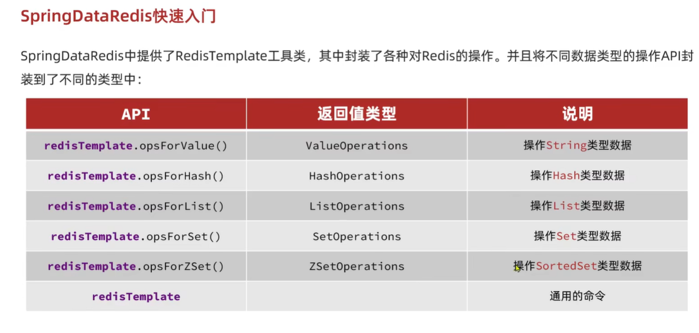
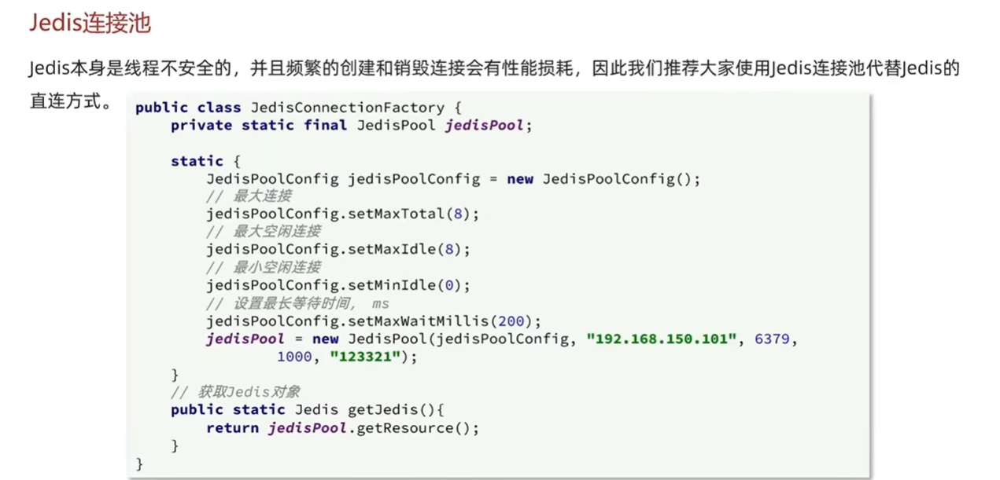

# Redis學習

--- 

## [Redis 基礎指令篇](Redis基礎指令篇)
## Java Redis Client 比較
| Client             | 說明                                                                                          | 特點                                                                                         |
|--------------------|---------------------------------------------------------------------------------------------|----------------------------------------------------------------------------------------------|
| **Jedis**          | 以 Redis 命令作為方法名稱，學習成本低，簡單實用。                                              | 單執行緒**不安全**，多執行緒環境下需基於連接池使用。                                          |
| **Lettuce**        | 基於 **Netty** 實現，支援同步、非同步和響應式編程方式，並且是**執行緒安全**的。                  | 支援 Redis 的哨兵模式、集群模式和管道模式。                                                  |
| **Redisson**       | 基於 Redis 實現的分布式、可伸縮的 Java 資料結構集合。                                          | 包含 Map、Queue、Lock、Semaphore、AtomicLong 等強大功能。                                    |
在 Spring Data Redis 裡，官方推薦的主要是 **Jedis** 和 **Lettuce**。

---

## Spring DataRedis 快速入門

---

[**JAVA Redis 使用測試**](src/test/java/com/ruihao/test/JedisTest.java)  
[**連接池配置**](src/main/java/com/ruihao/util/JedisConnectionFactory.java) 或者不想寫 code 
直接[**設置資源檔**](src/main/resources/application.yml)
 

---

## RedisTemplate 兩種序列化方法
### 方法一:
- 1.自定義 RedisTemplate
- 2.修改 RedisTemplate 的序列化器為 GenericJackson2JsonRedisSerializer  
[示範方法一](src/test/java/com/ruihao/test/RedisTest.java)
和[自定義 RedisTemplate](src/main/java/com/ruihao/config/RedisConfig.java)
### 方法二:
- 1.使用 StringRedisTemplate
- 2.寫入 Redis 時,手動把對象序列化為 JSON
- 3.讀取 Redis 時,手動把讀取到的 JSON 反序列化為對象  
[示範方法二](src/test/java/com/ruihao/test/RedisStringTest.java)  
###  ***方法一 比較靈活 但會占用較多的空間使用量 方法二 可以節省空間使用量***

