## Redis 

---

##  Redis 客戶端方式:
### Redis 命令行字元客戶端:
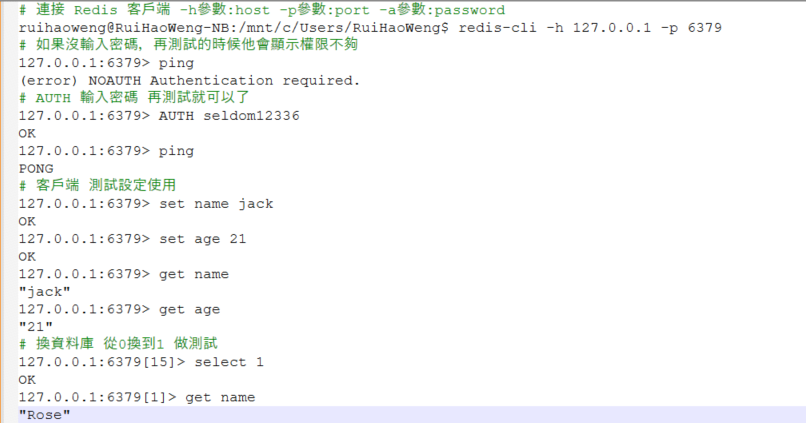
### Redis 圖形化介面客戶端:
[圖形化桌面客戶端 下載區](https://github.com/lework/RedisDesktopManager-Windows/releases)  
**Redis 圖形化介面連線方式**
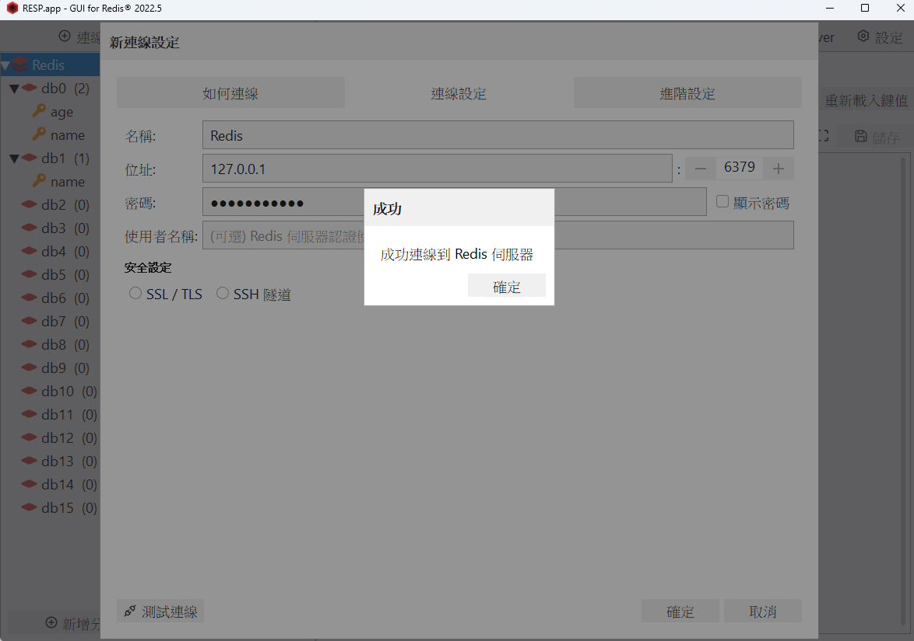

---

## Redis 數據結構介紹
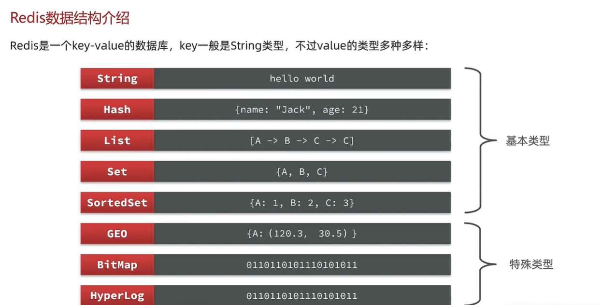
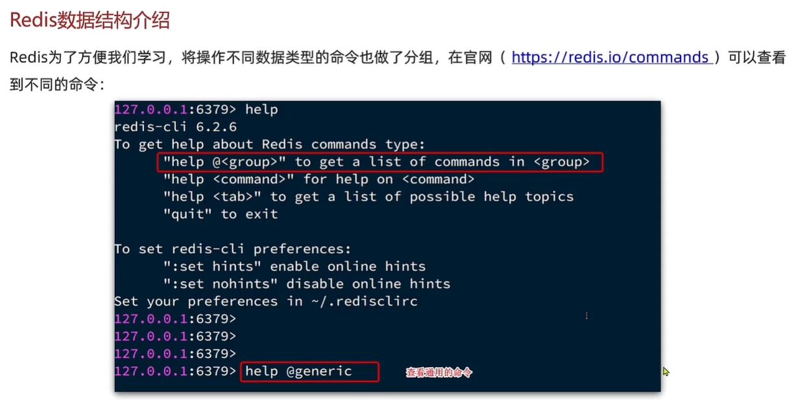

---

## Redis 命令:
### 通用命令
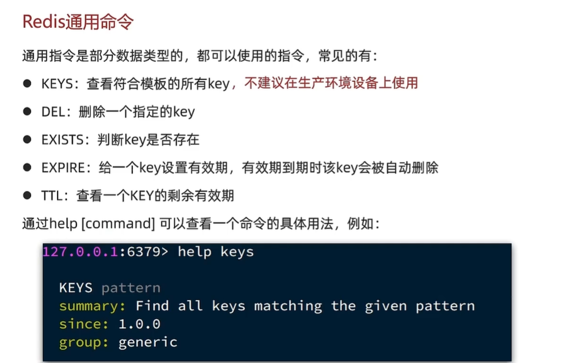

---

### String 類型
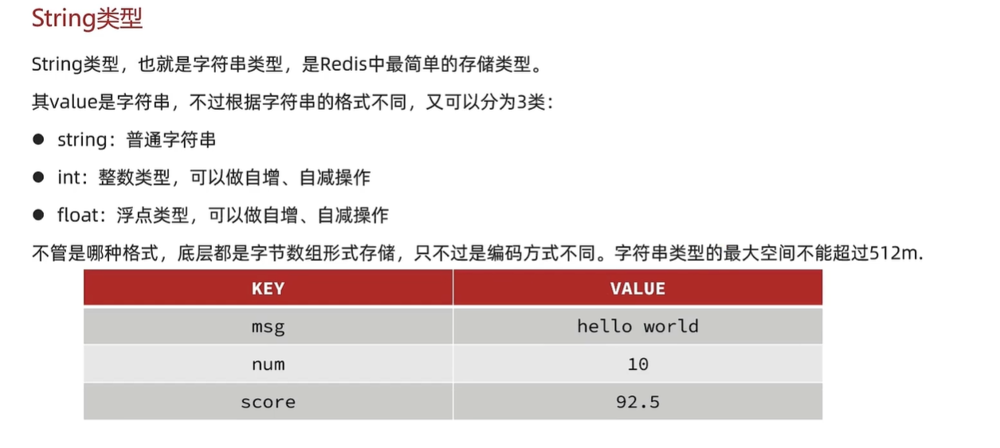
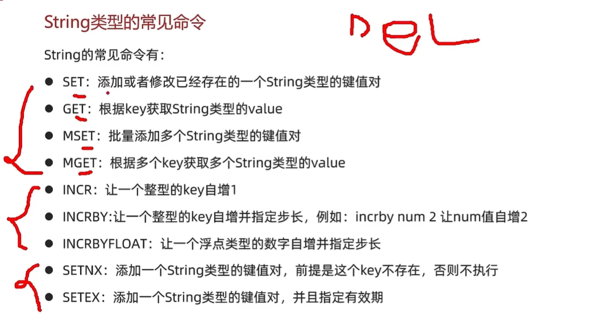

---

### Hash 類型
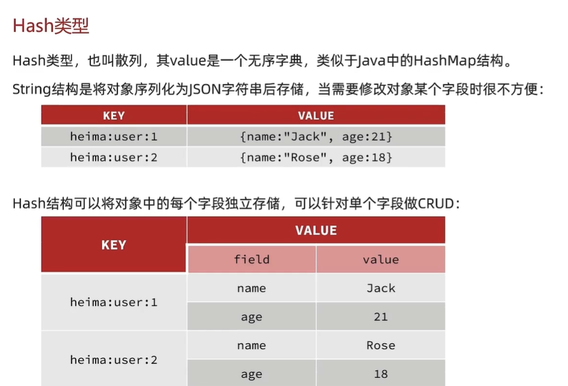
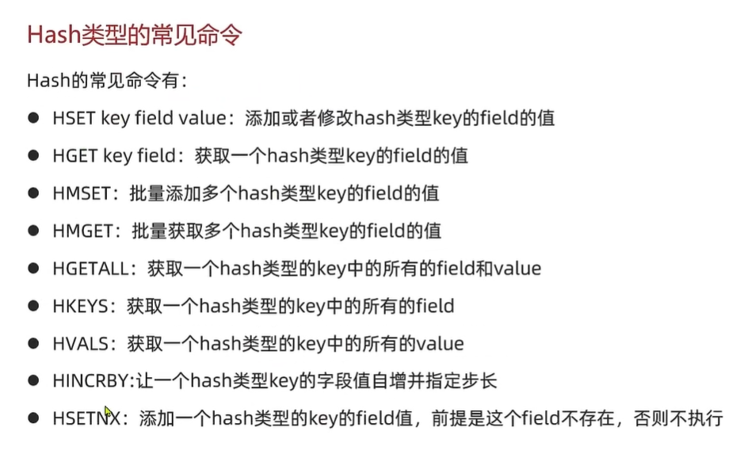

---

### List 類型
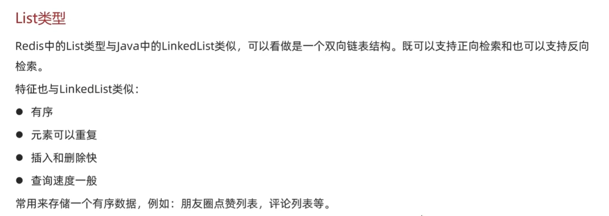
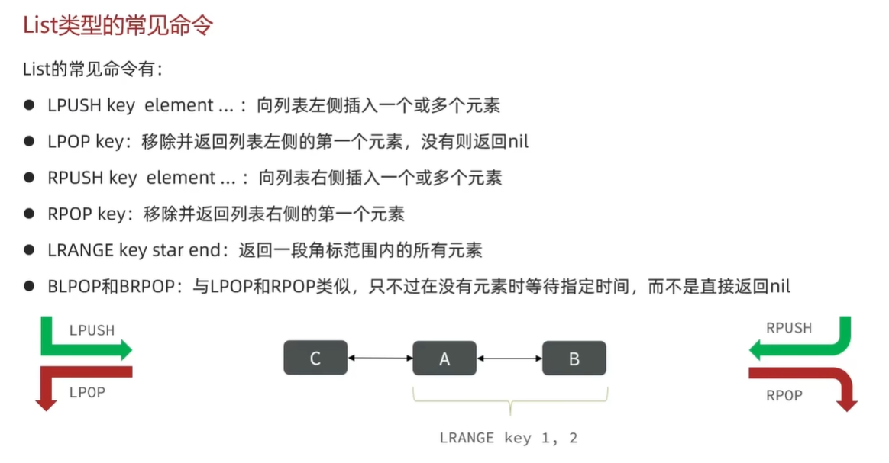
***思考***  
**如何利用 List 結構模擬一個 Stack?**
- 讓入口和出口同一邊:利用 LPUSH LPOP 達到先進後出

**如何利用 List 結構模擬一個 Queue?**
- 讓入口和出口不同一邊:利用 LPUSH RPOP 達到先進先出

**如何利用 List 結構模擬一個阻塞 Queue?**
- 入口和出口不同一邊，同時用 BLPOP BRPOP 達到先進先出的阻塞效果

---

### Set 類型
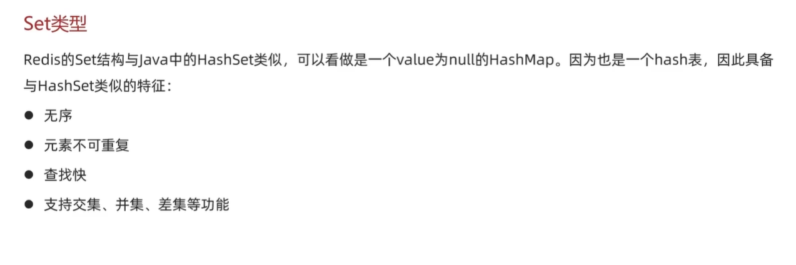
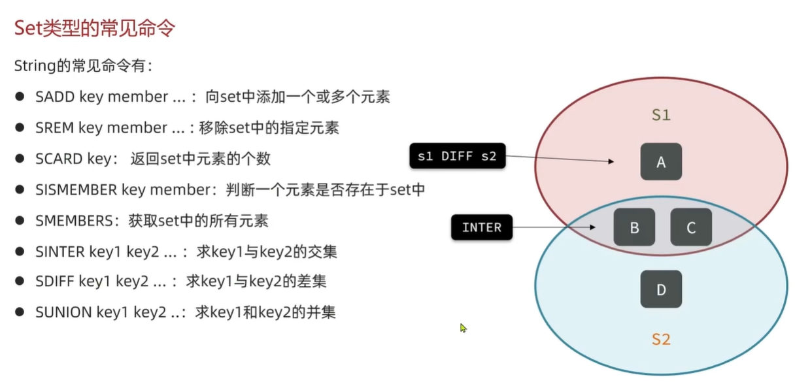

---

### SortedSet 類型

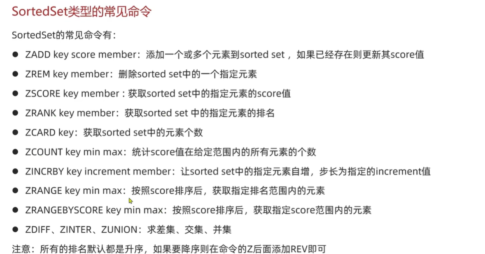

---

### Key 層級格式
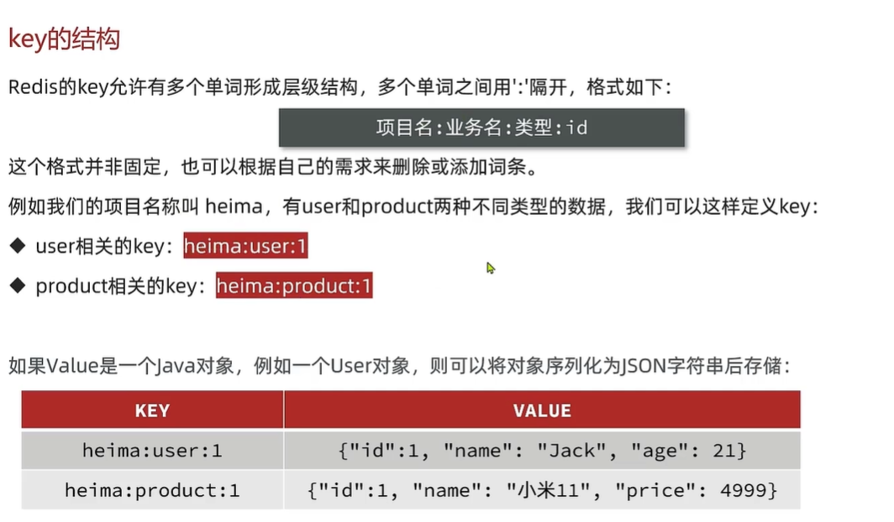
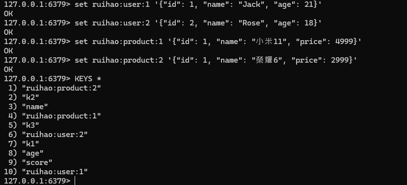
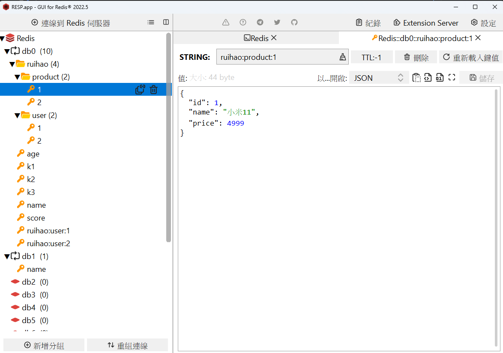

---

### 總結
**String 類型的三種格式**
- 字符串
- int
- float  

**Redis 的 key 的格式**
- [項目名]: [業務名] : [類型] : [id]

