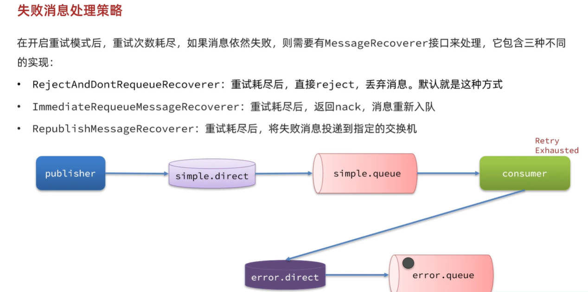

# 系統調用方式與消息中介概念整理

---

## 一、同步調用 (Synchronous Call)

### 特點
- 調用方發送請求後，**必須等待結果返回**才能繼續。
- 呼叫鏈條緊密，常用於需要即時反饋的場景。

### 優點
- **邏輯簡單**：流程清楚，呼叫即返回。
- **即時反饋**：適合需要強一致性的場景。

### 缺點
- **耦合度高**：調用方與服務提供方強依賴。
- **性能瓶頸**：等待時間長，資源容易浪費。
- **擴展性差**：高併發時容易阻塞。

---

## 二、異步調用 (Asynchronous Call)

### 特點
- 基於**消息通知**的方式，發送請求後不必等待結果。
- 三個角色：
    - **消息發送者**：發送消息的人（調用方）。
    - **消息代理**：管理、暫存、轉發消息（例如 RabbitMQ、Kafka）。
    - **消息接收者**：最終接收並處理消息的人（服務提供方）。

### 優點
- **解耦**：調用方與接收方透過代理解耦。
- **高效能**：發送後立即返回，提升系統吞吐量。
- **可擴展**：可同時對接多個消費者。
- **容錯性高**：接收方不可用時，消息可暫存。

### 缺點
- **邏輯較複雜**：需要額外的消息系統。
- **一致性挑戰**：結果非即時，可能短暫不一致。
- **重試與冪等問題**：消息可能重複，需要額外處理。

---

## 三、RabbitMQ 的重要名詞與概念

### 名詞解釋
- **Publisher (生產者)**：產生訊息並發送到 Exchange。
- **Exchange (交換器)**：根據規則 (Routing Key、Binding) 將訊息分配到不同 Queue。
- **Binding (綁定)**：定義 Exchange 與 Queue 的關係。
- **Queue (佇列)**：儲存訊息，等待 Consumer 消費。
- **Consumer (消費者)**：從 Queue 取出並處理訊息。

### 流程簡述
1. Publisher 發送訊息給 Exchange。
2. Exchange 根據 Binding 規則，分配到對應 Queue。
3. Consumer 從 Queue 消費並處理訊息。

---

## 四、RabbitMQ exchange 類型

***比較特別的Topic***

---

## 五、同步與異步的使用場景比較

- **同步調用**：下單即時確認、登入驗證、即時查詢。
- **異步調用**：寄送通知郵件、記錄日誌、批量數據分析。

---

## 六、生產者的可靠性
- [***發送者重新連線***](publisher/src/main/resources/application.yml)

- [***發送者確認***](publisher/src/main/resources/application.yml)

### ***流程圖***

---

## 七、MQ的可靠性

### MQ可靠性的兩種方式:
- **1.資料持久化**

- **2.LazyQueue**

---

## 八、消費者的可靠性
- [***消費者確認機制***](consumer/src/main/resources/application.yml) 

- [***失敗重試機制***](consumer/src/main/resources/application.yml)  

---

## 總結:
### RabbitMQ如何保證生產者可靠性
- 1.可以在 **RabbitMQ** 的 **生產者的配置資源** 提供重連機制->連接MQ之前會有網路波動
，他會重新連接，避免因為網路波動導致消息傳送失敗。
- 2.如果是其他原因導致消息重送失敗，**RabbitMQ** 支持生產者 **confirm機制**，只要發送消息到MQ時，
會給一個ack回執，如果傳送失敗，他會反給一個nack回執，基於回執的判斷來決定是否重發消息。  

***以上手段都會增加系統的負擔和資源消耗，因此大部分都不會去開啟confirm機制，除非對消息的可靠性有比較高的要求***
### RabbitMQ如何保證MQ消息的可靠性
- 1.先通過配置可以讓交換機、對列、和發送的消息都持久化。這樣對列中的消息會持久化到磁盤，**RabbitMQ**重啟消息依然存在
- 2.RabbitMQ 在3.6版本引入 **LazyQueue**，並且在3.12版本後會稱為對列的默認模式。**LazyQueue** 會將所有消息都持久化
- 3.開啟持久化和生產者確認時，**RabbitMQ** 只有在消息持久化完成後才會給生產者返回ACK回執  
**[範例 : 看 listenDirectQueue1 方法](consumer/src/main/java/com/javaBasic/listeners/MQListener.java)**
### 消費者如何保證消息一定會消費
- 1.開啟消費者確認機制為 auto,由 spring 確認消息處理成功後返回 ack,異常時返回 nack
- 2.開啟消費者失敗重試機制,並設置 MessageRecover,多次重試後將消息轉發到異常交換機,由人工處理  
  **[消費者 確認機制 跟 失敗重試機制 的配置設定](consumer/src/main/resources/application.yml)**

