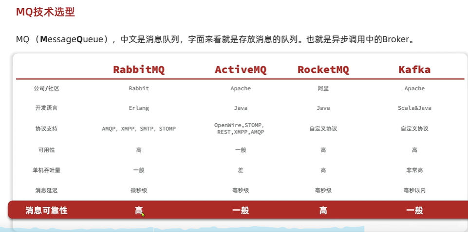

### 1. Executor 與執行緒池 和 Future 與非同步任務
- [Java Executor 常見執行緒池](src/main/java/com/javaBasic/javaBasic/threadpool)
    - FixedThreadPool / CachedThreadPool / SingleThreadExecutor
    - ScheduledThreadPool / WorkStealingPool
    - 各種池子的特性、適用場景與風險
- [Future 應用指南]()
    - 基本用法：submit + get
    - 實務場景：平行計算、API 超時、任務取消、批次下載
    - 小結表格（各場景對應的 API 用法）

### 2. Spring 異步處理
- [Spring 異步處理方式比較](src/Spring異步處理方式比較表/readme.md)
    - `@Async` 與 ThreadPoolTaskExecutor
    - `@Scheduled` 與 ThreadPoolTaskScheduler
    - WebFlux 的 NIO EventLoop 模型  

### 3. 常見的併發設計模式
- [Java 多執行緒程式設計](src/main/java/com/javaBasic/javaBasic/concurrent)
  - 生產者–消費者模式（BlockingQueue）
  - 工作竊取 (Work Stealing)
  - Future + CompletionService 處理批量任務
  - Atomic 類 (無鎖計數器)
  - 併發集合
### 4. RabbitMQ 應用

- [系統調用方式與消息中介概念整理](src/RabbitMQ)
  - 同步調用 (Synchronous Call) 和 異步調用 (Asynchronous Call)
  - RabbitMQ 的重要名詞與概念