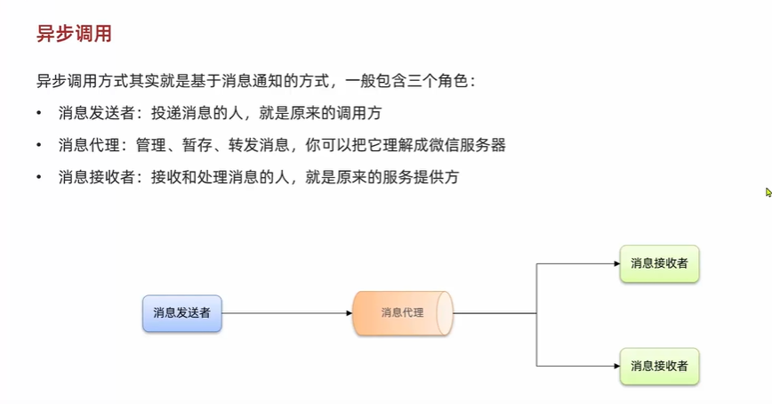
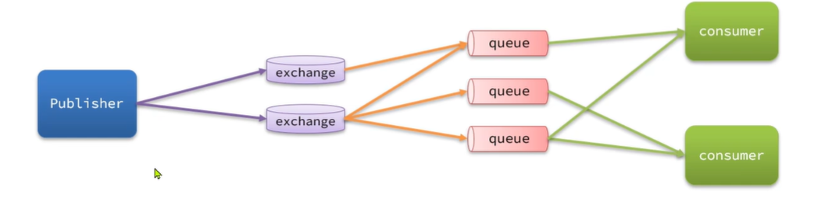

# 系統調用方式與消息中介概念整理

---

## 一、同步調用 (Synchronous Call)

### 特點
- 調用方發送請求後，**必須等待結果返回**才能繼續。
- 呼叫鏈條緊密，常用於需要即時反饋的場景。

### 優點
- **邏輯簡單**：流程清楚，呼叫即返回。
- **即時反饋**：適合需要強一致性的場景。

### 缺點
- **耦合度高**：調用方與服務提供方強依賴。
- **性能瓶頸**：等待時間長，資源容易浪費。
- **擴展性差**：高併發時容易阻塞。

---

## 二、異步調用 (Asynchronous Call)

### 特點
- 基於**消息通知**的方式，發送請求後不必等待結果。
- 三個角色：
    - **消息發送者**：發送消息的人（調用方）。
    - **消息代理**：管理、暫存、轉發消息（例如 RabbitMQ、Kafka）。
    - **消息接收者**：最終接收並處理消息的人（服務提供方）。

### 優點
- **解耦**：調用方與接收方透過代理解耦。
- **高效能**：發送後立即返回，提升系統吞吐量。
- **可擴展**：可同時對接多個消費者。
- **容錯性高**：接收方不可用時，消息可暫存。

### 缺點
- **邏輯較複雜**：需要額外的消息系統。
- **一致性挑戰**：結果非即時，可能短暫不一致。
- **重試與冪等問題**：消息可能重複，需要額外處理。

---

## 三、RabbitMQ 的重要名詞與概念

### 名詞解釋
- **Producer (生產者)**：產生訊息並發送到 Exchange。
- **Exchange (交換器)**：根據規則 (Routing Key、Binding) 將訊息分配到不同 Queue。
- **Binding (綁定)**：定義 Exchange 與 Queue 的關係。
- **Queue (佇列)**：儲存訊息，等待 Consumer 消費。
- **Consumer (消費者)**：從 Queue 取出並處理訊息。

### 流程簡述
1. Producer 發送訊息給 Exchange。
2. Exchange 根據 Binding 規則，分配到對應 Queue。
3. Consumer 從 Queue 消費並處理訊息。

---

## 四、同步與異步的使用場景比較

- **同步調用**：下單即時確認、登入驗證、即時查詢。
- **異步調用**：寄送通知郵件、記錄日誌、批量數據分析。  
